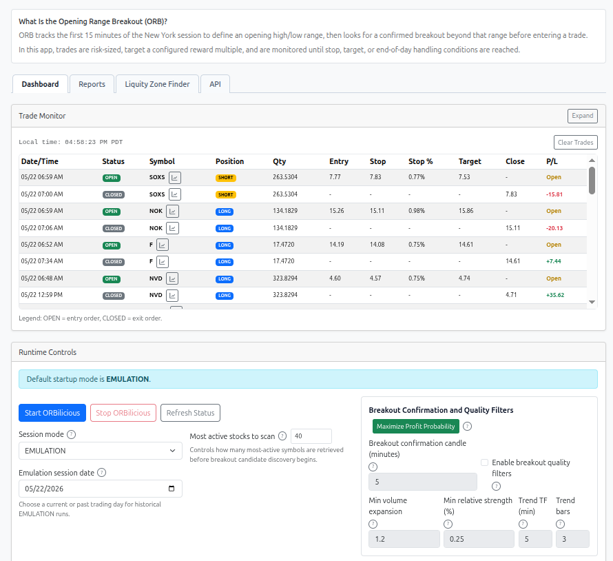
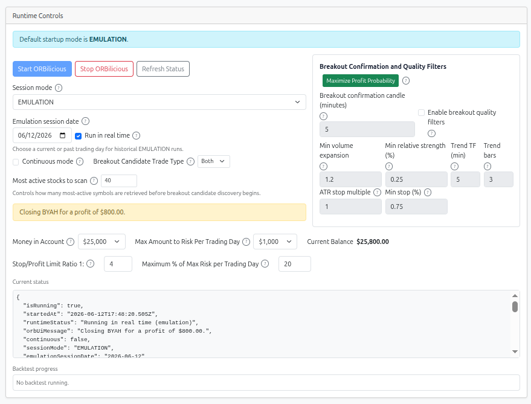
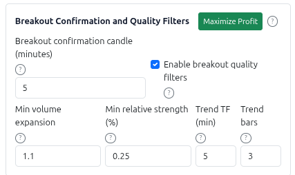
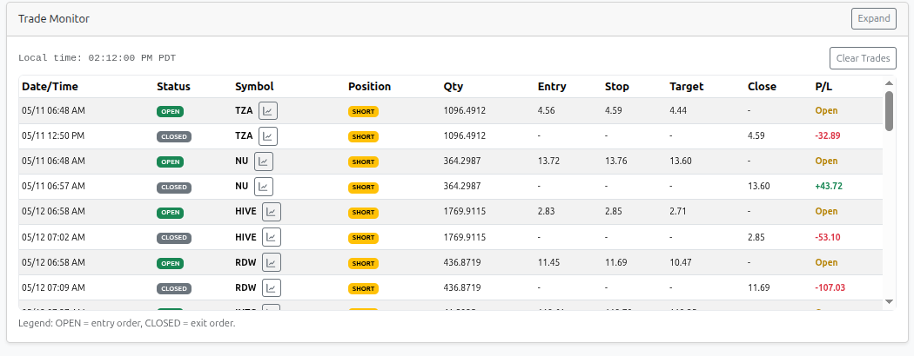
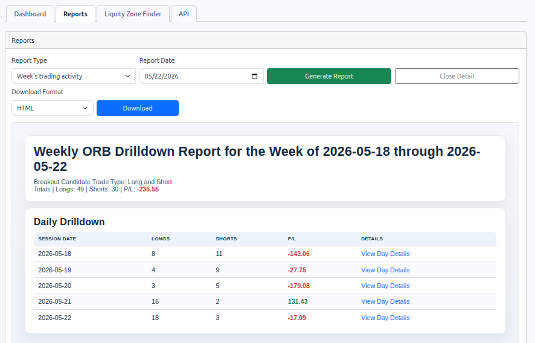
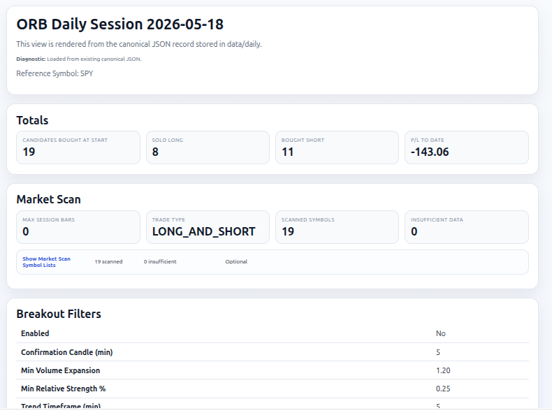
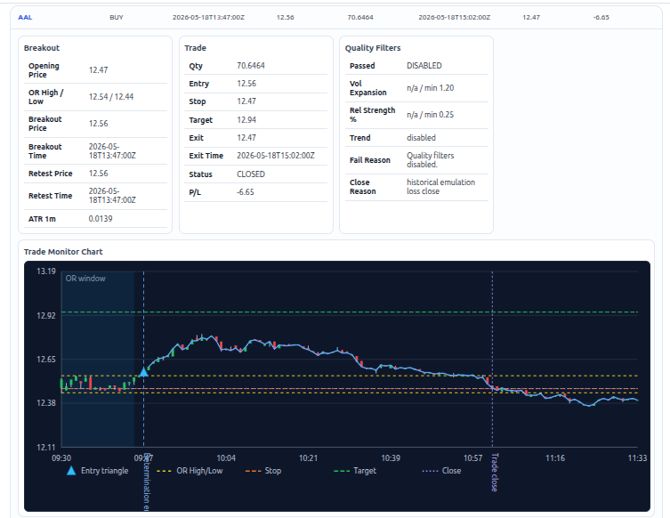
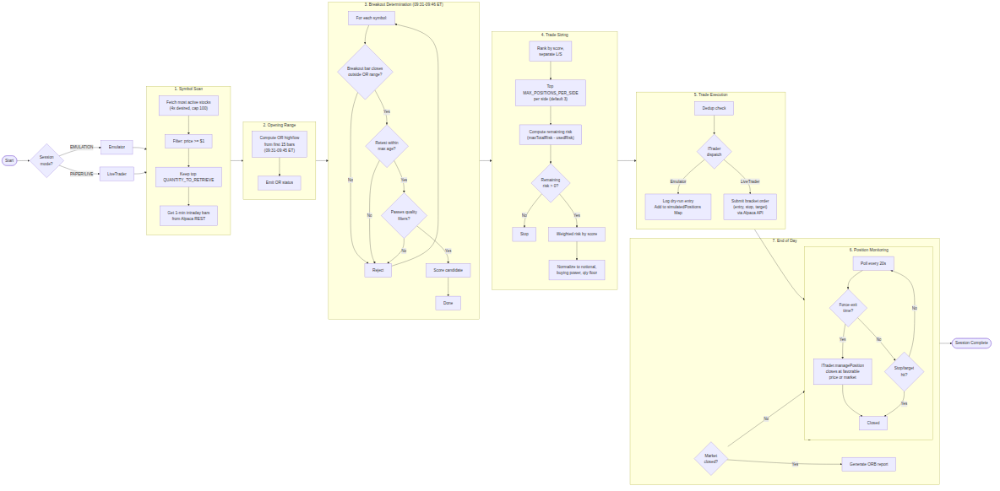

# ORBilicious 0.0.8

## Table of Contents

- [Setup](#setup)
- [Startup Scripts](#startup-scripts)
- [User Manual](#user-manual)
  - [System Requirements](#system-requirements)
  - [Runtime Controls](#runtime-controls)
  - [How to use the Breakout Confirmation and Quality Filters](#how-to-use-the-breakout-confirmation-and-quality-filters)
  - [Trade Monitor](#trade-monitor)
  - [Daily Summary](#daily-summary)
  - [Reports](#reports)
  - [Reports Weekly Summary](#reports-weekly-summary)
  - [Reports Daily Detail](#reports-daily-detail)
- [Developer Notes](#developer-notes)
  - [Trading Architecture](#trading-architecture)
  - [Strategy Rules](#strategy-rules)
  - [Operational Rules](#operational-rules)
  - [Resilience and Stability](#resilience-and-stability)
  - [Logging](#logging)
    - [General Description](#general-description)
    - [Trade Log Format](#trade-log-format)
  - [Environment Variables](#environment-variables)
  - [Report Modes and Scheduling](#report-modes-and-scheduling)
  - [Tests](#tests)
- [Notes](#notes)
- [Recommended Next Upgrades](#recommended-next-upgrades)

ORBilicious is a Node + TypeScript project that implements the [Opening Range Breakout strategy](https://www.equiti.com/sc-en/news/trading-ideas/opening-range-breakout-strategy/). The project identifies stocks with a high probability of generating profit by detecting breakout price action. It begins by discovering the most actively traded stocks during the first minute after the New York markets opens. (Discovery occurs on a daily basis.) These stocks are then monitored over a 15-minute period using 1-minute candlesticks. Based on this observation and analysis, ORBilicious selects the daily set of breakout candidates—stocks that conform to the selection parameters defined by the Opening Range Breakout strategy. Then, ORBilicous executes the breakout candidates as long or short trades according to profit seeking entry and close behavior assumed in the Opening Range Breakout strategy. The project has the following features:

- [Alpaca](https://alpaca.markets/) market-data integration
- Alpaca bracket-order execution (PAPER and LIVE modes)
- Mode-independent emulation via `Emulator` class (EMULATION mode, no orders)
- `ITrader` interface decoupling core strategy from mode-specific execution
- Configurable most-active universe scan (default 40)
- Weighted total stop-risk sizing
- Basket normalization to fit both total planned stop-loss risk and available buying power
- Winston-based structured logging
- Source-level ORB PDF report generation (end-of-day live or historical by date)



## Intended User

The intended user of this application is a person familiar with the practice of active investing in the NY Stock Markets and understands the Open Range Breakout strategy as it applies to day trading.

## Important Disclaimer

**Be advised:** The creator of this application is NOT a financial adviser in any sense and takes absolutely no responsibility for the performance and behavior of this application. **You are using the application AT YOUR OWN RISK!**

## User Manual

### System Requirements

#### Hardware

- **Processor:** Multi-core CPU (2+ cores recommended)
- **Memory:** 4 GB RAM minimum, 8 GB recommended
- **Disk:** 500 MB free space for application files, logs, and generated reports

#### Software

- **Runtime:** Node.js 20.x or later ( LTS recommended)
- **Package Manager:** npm (bundled with Node.js)
- **Operating System:** macOS, Linux, or Windows with WSL
- **Browser:** Modern browser (Chrome, Firefox, Safari, Edge) for Web UI access
- **Alpaca Account:** Valid Alpaca API key and secret key for market data and/or trading

#### Network

- **Internet connection:** Required for live trading and real-time market data
- **Alpaca API access:** Outbound HTTPS (port 443) to `data.alpaca.markets` and `paper-api.alpaca.markets` or `api.alpaca.markets`

### Setup

1. Install dependencies:

```bash
npm install
```

1. Create and configure `.env` as described below.

2. Configure `.env`. Use [.env.example](.env.example) as the starting template for your local runtime configuration.

3. Copy the file into `.env`:

```bash
cp .env.example .env
```

Then edit `.env` for operational use:

1. Set `APCA_API_KEY_ID` and `APCA_API_SECRET_KEY` to your own Alpaca credentials.
2. Set `SESSION_MODE` to the mode you intend to run: `EMULATION`, `PAPER`, or `LIVE`. (This value is reset automatically when the UI resets the value.)
3. Set `SESSION_DATE` to a historical date for historical emulation, or leave it blank for current-day operation. (This value is reset automatically when the UI resets the value.)
4. Set `ALPACA_DATA_FEED` to `iex` if delayed market data is acceptable, or `sip` if your Alpaca account has the required entitlement for real-time consolidated market data.
5. Review trading controls such as `MAX_TOTAL_RISK`, `HARD_BASKET_CAP`, `MAX_POSITION_NOTIONAL`, and `MAX_POSITIONS_PER_SIDE` before running. (This value is reset automatically when the UI resets the value.)
6. If you are operating against live capital, verify `ALPACA_TRADING_BASE_URL`, `SESSION_MODE=LIVE`, and all risk settings before starting the app.

The comments in [.env.example](.env.example) explain the meaning of each variable inline.

Run in dev mode:

```bash
npm run dev
```

Or build and run:

```bash
npm run build
npm start
```

### Startup Scripts

All `npm run <script>` commands are defined in `package.json` in the project root.

| Script | What it does | Why it exists |
| --- | --- | --- |
| `build` | Compiles TypeScript to JavaScript via `tsc -p tsconfig.json`. | Required before running `start` or `start:web`; produces the `dist/` directory. |
| `test` | Runs all unit tests through Mocha with ts-node. | Validates strategy, breakout detection, trade sizing, and API integration logic. |
| `test:smoke` | Runs smoke tests only (files named `*.smoke.ts`). Enabled by `RUN_SMOKE_TESTS=1`. | Quick sanity check before a full test run. |
| `test:coverage` | Runs tests under `nyc` for code-coverage measurement. | Identifies untested code paths. |
| `test:coverage-fast` | Same as `test:coverage` but excludes the slow `reporting.test.ts` file. | Faster iteration during development. |
| `coverage:report` | Generates HTML/LCov coverage reports from a prior `test:coverage` run. | Opens the HTML report in a browser for visual inspection. |
| `dev` | Runs the ORB trading engine directly via `tsx src/main.ts` without compiling. | Fast inner-loop development — no build step needed. |
| `dev:web` | Starts the ORBilicious web UI server via `tsx src/web/server.ts` on port 8787. | Develop and test the dashboard, runtime controls, and reports without rebuilding. |
| `start` | Runs the compiled trading engine via `node dist/web/server.js`. | Production-like execution after `build`. |
| `start:web` | Same as `start` — alias for consistency. | Alternate entry point; both run the web UI server from compiled output. |
| `typecheck` | Runs the TypeScript compiler in `--noEmit` mode to check types without emitting files. | Validates type safety — use before committing or in CI. |
| `full-start` | Builds and serves the Gatsby documentation site (port 9000) in the background, then starts the ORBilicious web UI (port 8787). | One-command startup for both the application and its documentation. |
| `full-stop` | Kills `gatsby serve`, `node dist/web/server`, and `tsx src/web/server` processes. | Cleans up all services started by `full-start`. |
| `clean` | Removes log files (`logs/orbilicious-*.log`, `logs/trades/`, `logs/*.gz`). | Frees disk space and resets log state between runs. |

### Web UI Usage

The web client provides a complete control panel to run and monitor the ORB strategy. Start it using:

```bash
./start.sh
```

This starts the web server on port 8787 by default and opens the UI automatically. Start ORBilicious from the web UI Start button so the Trade Monitor remains connected to runtime events.

Common usage:

```bash
./start.sh --no-open
```

This runs the web server without auto-opening a browser tab.

Supported options for `./start.sh`:

- `--no-open`, `-n`: Do not auto-open the browser.
- `--web-port <PORT>`, `-p <PORT>`: Set the web server port.
- `--web-port=<PORT>`: Alternate inline form for setting the web server port.
- `--help`, `-h`: Print command help and exit.

Notes:

- If no port option is provided, `WEB_PORT` is used when set; otherwise the default is `8787`.
- Any extra positional arguments are ignored by `./start.sh`.

#### Runtime Controls



- **Session mode**: Choose `EMULATION` (Alpaca data, no orders), `PAPER` (paper trading), or `LIVE` (live trading).
- **Emulation session date**: For `EMULATION` mode, select a past trading day to run a historical backtest from that date forward.
- **Most active stocks to scan**: Set how many most-active symbols are retrieved before breakout candidate discovery starts (default `40`). Internally, the app over-fetches most-active symbols for filtering (`4 x QUANTITY_TO_RETRIEVE`) but caps that fetch at `100` symbols.
- **Continuous mode**: Run the strategy continuously (only available in `PAPER` and `LIVE` modes).
- **Breakout Candidate Trade Type**: Filter which breakout directions are considered. Choose `Long` to accept only bullish breakouts, `Short` to accept only bearish breakouts, or `Both` (default) to accept either direction.
- **Money in Account**: Total account capital available (default $25,000). Overrides `HARD_BASKET_CAP` env var.
- **Max Amount to Risk Per Trading Day**: Maximum total stop-loss risk per day (default $1,000). Overrides `MAX_TOTAL_RISK` env var.
- **Current status**: Real-time execution state (running, stopped, error details).
- **Backtest progress**: For historical runs, shows current date, total dates, and completion.

#### How to use the Breakout Confirmation and Quality Filters



Use these controls together to reduce false breakouts while keeping enough opportunities for your session goals.

- **Breakout Confirmation Candle (minutes)** controls how long the breakout candle is. The breakout must close outside the opening range on this timeframe.
- **Breakout Quality Filters** turns quality gating on or off. Quality gating means a breakout must pass all enabled quality checks before it is considered tradeable (volume expansion, relative strength/weakness, and higher-timeframe trend alignment).
- **Min Volume Expansion** requires breakout-candle volume to exceed recent confirmation-candle volume by a minimum ratio.
- **Min Relative Strength (%)** requires the breakout close to clear the opening-range boundary by a minimum percentage.
- **Trend Timeframe (minutes)** and **Trend Lookback Bars** define higher-timeframe trend alignment.

Retest freshness is also enforced by environment setting: `BREAKOUT_RETEST_MAX_AGE_MINUTES` (default `1`). In the current NY session, entries are skipped when the confirmation retest is older than this threshold. Set it to `0` to disable staleness filtering. In EMULATION mode the staleness check is bypassed entirely so all session breakouts are evaluated.

`BREAKOUT_QUALITY_FILTERS_ENABLED` is the single source of truth for both the Web UI's initial checkbox state and the runtime strategy behavior.

Suggested workflow:

1. Start with defaults (`5` minute confirmation, quality filters off, volume `1.2`, relative strength `0.25`, trend timeframe `5`, lookback `3`).
2. Run emulation for several recent sessions and watch candidate count, pass/fail behavior, and P/L consistency.
3. Tighten filters when you see too many weak or whipsaw entries.
4. Relax filters when you see too few candidates or missed valid breakouts.
5. Change one setting at a time so you can attribute the impact.

Concrete examples:

1. **Noisy open, too many fake breaks**
Configuration purpose: make confirmation stricter so brief spikes do not qualify as breakouts.
Configuration: set Breakout Confirmation Candle to `10` and keep Quality Filters enabled.
Expected outcome: fewer breakout candidates, later but higher-confidence entries, and reduced churn from quick reversals.

2. **Strong trend day, but valid breakouts are being missed**
Configuration purpose: allow more momentum names through without fully removing quality checks.
Configuration: keep confirmation at `5`, lower Min Relative Strength to `0.15`, and lower Min Volume Expansion to `1.1`.
Expected outcome: more candidates pass during broad directional moves, with a moderate increase in trade frequency and slightly more variance in results.

3. **Choppy session with mixed direction and weak follow-through**
Configuration purpose: require stronger alignment so only the cleanest breakouts survive.
Configuration: keep confirmation at `5`, raise Min Volume Expansion to `1.5`, raise Min Relative Strength to `0.35`, set Trend Timeframe to `15`, and Trend Lookback Bars to `4`.
Expected outcome: candidate list shrinks meaningfully, entries align better with sustained trend context, and whipsaw exposure is reduced at the cost of fewer total trades.

#### Filter Attribution in Reports

Every generated HTML report includes a **Filter Attribution** section that records the per-candidate quality-filter outcome for each symbol that produced a valid breakout bar and a confirmation retest during the session. This section is designed to support ongoing attribution analysis so you can tune filter settings over time with real data instead of intuition alone.

Each row in the table shows:

| Column | Description |
| --- | --- |
| **Symbol** | The evaluated ticker. |
| **Side** | Breakout direction (`buy` or `sell`). |
| **Result** | `PASS` if the candidate survived all quality checks; `FAIL` otherwise. |
| **Vol Expansion** | Measured breakout-candle volume divided by prior confirmation-candle average, alongside the configured minimum. |
| **VE ✓/✗** | Whether the volume expansion check passed. |
| **Rel Strength** | Measured close-to-OR-boundary move as a percentage, alongside the configured minimum. |
| **RS ✓/✗** | Whether the relative strength check passed. |
| **Trend** | Whether the higher-timeframe close and slope were aligned with the breakout direction. |
| **TR ✓/✗** | Whether the trend alignment check passed. |
| **Notes** | Any skip reason or multi-filter fail details. When quality filters are globally disabled the row shows `filters off`. |

When quality filters are disabled (`BREAKOUT_QUALITY_FILTERS_ENABLED=false`), all candidates automatically pass and the individual check columns show `n/a`. The table is still populated so you can see the full breakout universe considered for each session.

Rows are sorted with passing candidates first. The interactive drilldown cards in the dark-mode HTML report also include a **Quality Filters** sub-table showing the same per-filter detail inline with the chart and trade data.

To use this data for attribution analysis:

1. Run emulation across several historical sessions using your current filter settings.
2. Open the HTML reports and compare the **Filter Attribution** table against the **Breakout Candidates** trade outcomes.
3. Look for patterns: symbols that failed a specific check but would have been profitable, or symbols that passed all checks but still lost.
4. Adjust one filter threshold at a time and re-run the same sessions to measure the change in both candidate count and P/L distribution.

#### Trade Monitor



Live view of all executed entries and closes with:

- **Date/Time**: When the trade entry or close occurred.
- **Status**: `OPEN` for entries, `CLOSED` for exits.
- **Symbol, Side, Qty**: Trade details.
- **Entry, Stop, Target, Close**: Price levels.
- **P/L**: Profit/loss for closed trades, or "Open" for active positions. Green text for profits, red for losses.

Expand the pane to see more rows at once.

#### Daily Summary

Aggregated profit/loss by trading day. Shows:

- **Date**: Calendar day.
- **Total P/L**: Sum of all closed-trade P/L for that day. Green for net profit, red for net loss.

Expand the pane to scroll through historical days.

#### Reports



- **Select a report**: Choose from generated HTML or PDF reports.
- **Refresh List**: Fetch latest reports from the `reports/` directory.
- **Open Report**: Display the selected report in an embedded viewer.

#### Reports Weekly Summary



#### Reports Daily Detail



The **candlestick chart** plots 1-minute bars for the session with the opening-range window shaded. The legend identifies:

- **OR High/Low** (yellow dashes) — the opening-range boundaries calculated from the first 15 minutes of trading
- **Stop price** (orange dashes) — the stop-loss level set at the wick of the bar immediately before the breakout
- **Profit target** (green dashes) — the 4R take-profit level based on the entry-to-stop distance
- **Close price** (purple dashes) — the exit price of the trade
- **Entry triangle** (blue) — marks the entry point at the confirmation retest close
- **Determination line** (vertical blue dashed) — the point at which the breakout retest was confirmed

Below the chart, each detail row lists:

- **Symbol** — the ticker being evaluated
- **Opening price** — the first traded price of the session
- **OR High / OR Low** — the highest and lowest prices during the 15-minute opening range
- **Breakout price / timestamp** — the price and time of the first confirmation-candle close outside the opening range
- **Confirmation retest price / timestamp** — the price and time of the subsequent bar that traded back to the opening-range boundary and closed beyond it
- **ATR** — the 14-bar average true range used for evaluating stop-distance viability
- **Side** — whether the breakout was a buy (long) or sell (short) signal

## Developer Notes

### Workflow



### Trading Architecture

ORBilicious separates emulation and live trading into two independent classes behind a common `ITrader` interface, avoiding interleaved `if (env.dryRun)` branching throughout the core logic.

- **`ITrader` interface** (`src/trading/trader-interface.ts`): Defines the contract for all mode-specific operations — `getAccount()`, `getPosition()`, `closePosition()`, `executeTrades()`, `computeUsedRisk()`, and `managePosition()`. The core `app.ts` functions (`evaluateSymbol`, `findBreakoutCandidates`, `executeSizedTrades`, `runCycle`) take an `ITrader` parameter and never branch on session mode directly.

- **`Emulator`** (`src/trading/emulator.ts`): Used in `EMULATION` mode. Owns an in-memory `simulatedPositions` Map. `executeTrades()` logs dry-run entries and populates the map. `managePosition()` scans intraday bars for stop/target hits, handles the profit-capture window, emits trade-monitor events, and logs closes — all in-memory with no Alpaca API calls. `computeUsedRisk()` sums the stop-loss risk from all open simulated positions, enforcing `MAX_TOTAL_RISK` as a true daily cap.

- **`LiveTrader`** (`src/trading/live-trader.ts`): Used in `PAPER` and `LIVE` modes. Delegates `getAccount()`, `getPosition()`, and `closePosition()` to `AlpacaClient` for real Alpaca API calls. `executeTrades()` submits real bracket orders via `AlpacaClient.submitBracketOrder()`. `managePosition()` checks the profit-capture window and closes via Alpaca only when favorable. `computeUsedRisk()` returns 0 (buying power limits risk on Alpaca's side).

The trader is selected once at startup in `startApp()` based on `env.sessionMode` (line 781 of `src/app.ts`):

```typescript
const trader: ITrader = env.sessionMode === 'EMULATION'
    ? new Emulator(client)
    : new LiveTrader(client);
```

### Strategy rules

- Target profit-taking (all-bars scan): Every session bar is scanned for stop/target hits, not just the latest bar. If any bar since entry touched the take-profit price, the trade is closed immediately even if the latest bar has pulled back below target. This ensures profits are captured even when a spike hits the target and then reverses.
  - _Test: `strategy.test.ts` `it('closes position when target was hit on an earlier bar but latest bar is below target')`_
- Same-minute target/stop detection: The post-entry bar filter includes the bar whose 1-minute window contains the entry time. This ensures a target or stop hit that occurs on the same minute bar as the entry is still detected, even though the bar's timestamp (start of minute) is before the entry time.
  - _Test: `strategy.test.ts` `it('closes position when target is hit on the same-minute bar as entry')`_
- Pre-retest target profit-taking: If the stock price reaches the target price before a retest event occurs, the trade is immediately closed and profit is taken. This ensures that profits are captured if the target is achieved before a retest, regardless of further price action.
  - _Test: `strategy.profit-before-retest.test.ts` `it('closes the position and takes profit if target is hit before retest')`_
- Exclude most active stocks trading under $1: To avoid penny-stock noise, the app first retrieves `max(QUANTITY_TO_RETRIEVE, 4 x QUANTITY_TO_RETRIEVE)` most-active symbols from Alpaca, capped at 100 symbols, then fetches the latest trade price for each via the snapshots endpoint. Only symbols priced above $1 survive the filter, and the top `QUANTITY_TO_RETRIEVE` are kept for candidate evaluation. If fewer than `QUANTITY_TO_RETRIEVE` symbols pass the price filter, the unfiltered list is used as a fallback.
  - _References: `alpaca.ts` `getMostActiveSymbolsFiltered()` / `getLatestPrices()`; Test: `strategy.test.ts` `it('gets most active stocks and determines breakout candidates deterministically')`_
- Selection: Breakout candidates for long and short trades determined by breakout score. Breakout direction is determined by the confirmation-candle close relative to the opening-range high/low. Candidate symbols are sourced from the most-active universe returned by Alpaca.
  - _Tests: `basket.test.ts` `it('computes breakout score using relative breakout percent and log-volume')`, `strategy.test.ts` `it('returns BUY when candle closes above the opening range high')` / `it('returns SELL when candle closes below the opening range low')` / `it('gets most active stocks and determines breakout candidates deterministically')`_
- Stop loss:
  - Long: The stop loss for a long trade is primarily anchored to the low of the opening range. If a breakout wick anchor exists (the bar immediately before the breakout), its high is used as the stop price for additional conservatism. If not, the stop price defaults to the most conservative value among the opening-range low, an ATR-based stop (using a 14-bar average true range up to the confirmation retest), and the minimum stop-percent rule. The stop is only valid if the distance from entry to stop is positive and not equal at two-decimal precision. If these conditions are not met, the trade is rejected.
    - _Tests: `basket.test.ts` `it('uses the widest of opening-range, ATR, and minimum-stop distances when sizing')`, `rules.test.ts` `it('rules 18-19 and 21-24: builds only confirmed breakout candidates with wick anchors, ATR, and positive scores')`_
  - Short: same logic mirrored around opening-range high.
    - _Tests: `basket.test.ts` `it('uses the widest of opening-range, ATR, and minimum-stop distances when sizing')`, `rules.test.ts` `it('rules 18-19 and 21-24: builds only confirmed breakout candidates with wick anchors, ATR, and positive scores')`_
- Profit target: 4R, where R is the entry-to-stop distance by default (`1:4`), or the ratio declared in the environment variable `STOP_LOSS_PROFIT_RATIO`. **If the price reaches the profit target before a retest confirmation occurs, the trade is closed immediately and profit is taken, regardless of retest status.**
  - _Tests: `basket.test.ts` `it('builds weighted-risk trades and sets 4R profit targets')` / `it('applies configured STOP_LOSS_PROFIT_RATIO (1:2) so take-profit distance equals 2x stop distance')`, `rules.test.ts` `it('rules 25-30: ranks candidates, assigns weighted risk, derives stops and 4R targets, and normalizes to constraints')`_
- Risk budget: total planned stop-loss exposure across the basket defaults to $1000. Risk dollars are assigned proportionally by score. `runCycle()` calls `trader.computeUsedRisk()` to obtain risk already consumed — `Emulator` sums stop-loss risk from all open simulated positions, `LiveTrader` returns 0. If remaining risk is zero or negative, the cycle is skipped. This makes `MAX_TOTAL_RISK` a true daily cap rather than a per-cycle cap.
  - _Tests: `basket.test.ts` `it('selects and sizes all QUANTITY_TO_RETRIEVE candidate trades with weighted risk so total stop loss never exceeds MAX_TOTAL_RISK')`_ and `rules.test.ts` `it('rule 30b: cumulative risk across cycles stays within maxTotalRisk')`_
- Basket normalization: trade sizes are scaled so the full basket fits both:
  - configured total stop-loss risk cap
  - Alpaca account buying power
  - _Tests: `basket.test.ts` `it('normalizes the basket so risk and notional fit constraints simultaneously')` / `it('never rounds scaled qty up past the basket cap')`_
- Dynamic Maximize Profit Probability: The Maximize Profit Probability button uses a data-driven backend analysis. When clicked, it fetches recent historical price data for the selected symbol and session, analyzes volume expansion, relative strength, and trend, and automatically sets the breakout confirmation and quality filter values to optimize for current market conditions. This enables adaptive, context-aware filter settings for each run.
  - _Test coverage: no direct automated test; may be covered by integration/UI tests._

### Operational Rules

The list below follows the order the app actually applies rules at runtime.

<!-- markdownlint-disable MD029 -->

1. Startup configuration is validated first. Required Alpaca credentials must exist, numeric settings must parse, `STOP_LOSS_PROFIT_RATIO` must be a valid `risk:reward` pair, `SESSION_MODE` must be `EMULATION`, `PAPER`, or `LIVE`, and `SESSION_DATE` is normalized to `YYYY-MM-DD`.

- _Test: `rules.test.ts` — `it('rules 1-2: validates environment configuration and derives execution mode settings')`_

2. Execution mode is derived next. `EMULATION` instantiates an `Emulator` (in-memory simulation, no Alpaca API calls), `PAPER` and `LIVE` instantiate a `LiveTrader` (delegates to AlpacaClient for real orders). Both implement the `ITrader` interface so core cycle logic never branches on mode directly. The `--continuous` flag keeps the current-day scheduler running across sessions instead of exiting after one session.

- _Test: `rules.test.ts` — `it('rules 1-2: validates environment configuration and derives execution mode settings')`_

3. The app then splits into one of two operating paths: historical emulation or current-day scheduling. Historical emulation is only selected when `SESSION_MODE=EMULATION` and `SESSION_DATE` is set to a date before the current New York date. Live emulation for today stays on the current-day path.

- _Test: `rules.test.ts` — `it('rules 3-6 and 33: historical emulation filters weekdays, emits progress UI messages, skips failures, and reports closes')`_

4. In historical emulation with continuous mode (the `--continuous` flag or the test runner), the app builds an inclusive date range from `SESSION_DATE` through the current New York date, then filters that range to weekdays only. In non-continuous historical mode it processes only the single `SESSION_DATE` and exits. If no weekday sessions remain, the run ends immediately.

- _Test: `rules.test.ts` — `it('rules 3-6 and 33: historical emulation filters weekdays, emits progress UI messages, skips failures, and reports closes')`_

5. For each historical weekday session, the app emits UI progress messages in this order: `Determing open range.`, then `High range prices: {HIGH_RANGE_PRICE}, Low range prices: {LOW_RANGE_PRICE}.`, then `Identified Breakout Candidates, {SYMBOLS}` with the current most-active symbol list when available.

- _Test: `rules.test.ts` — `it('rules 3-6 and 33: historical emulation filters weekdays, emits progress UI messages, skips failures, and reports closes')`_

6. Each historical session then generates a full ORB report. If a session cannot be generated because data is unavailable or another error occurs, that session is skipped and the run continues to the next weekday.

- _Test: `rules.test.ts` — `it('rules 3-6 and 33: historical emulation filters weekdays, emits progress UI messages, skips failures, and reports closes')`_

7. A same-day emulation session that starts after market close (current New York time ≥ `FORCE_EXIT_TIME`) is treated as historical - the app runs the one-shot historical branch for that date and exits, rather than entering the live polling loop.

- _Test: `rules.test.ts` — `it('rule 7: same-day emulation after market close runs the historical branch')`_

8. In current-day mode, the loop runs forever until it is allowed to exit. On weekends it does nothing except wait. Before the New York open it does nothing except wait for the market to open.

- _Test: `rules.test.ts` — `it('rules 8 and 34: current-day scheduling waits before open and exits after generating one end-of-day report')`_

9. During market hours, the first `OPENING_RANGE_MINUTES` are treated as opening-range discovery time. The UI reports `Determing open range.` during that window. After the OR window completes, the app computes and publishes the opening-range high and low.

- _Test: `rules.test.ts` — `it('rules 9-10: current-day mode emits opening-range and waiting-for-breakouts UI messages after the OR window completes')`_

10. After the opening-range high/low are published, the app also publishes `Identified Breakout Candidates, {SYMBOLS}` with the current most-active symbol list when available.

- _Test: `rules.test.ts` — `it('rules 9-10: current-day mode emits opening-range and waiting-for-breakouts UI messages after the OR window completes')`_

11. Every active cycle starts by loading the Alpaca account. If `tradingBlocked` is true, the cycle stops immediately and no candidate evaluation or order logic runs.

- _Test: `rules.test.ts` — `it('rules 11-17: runCycle halts on trading block, and candidate evaluation handles positions, duplicates, and missing bars')`_

12. The candidate universe is sourced from Alpaca most-active symbols with a two-stage retrieval rule: fetch `max(QUANTITY_TO_RETRIEVE, 4 x QUANTITY_TO_RETRIEVE)` symbols, cap that fetch at 100, then apply the price filter (price >= $1.00) and keep the top `QUANTITY_TO_RETRIEVE` for evaluation. The default `QUANTITY_TO_RETRIEVE` is 40 symbols, and the Web UI can override this per run using the "Most active stocks to scan" spinner. This symbol fetch only occurs during the initial breakout-determination window (see [rule 42](#operational-rules)); after the window closes, no further most-active scanning takes place.

- _Test: `rules.test.ts` — `it('rules 11-17: runCycle halts on trading block, and candidate evaluation handles positions, duplicates, and missing bars')`_

13. Each symbol is evaluated independently. If the account already has an open position in that symbol, the app switches from entry logic to profit-capture management instead of generating a new breakout candidate.

- _Test: `rules.test.ts` — `it('rules 11-17: runCycle halts on trading block, and candidate evaluation handles positions, duplicates, and missing bars')`_

14. Existing-position management follows this order: if the position has no entry price, it is skipped; if there are no session bars, it is skipped; if the current bar is earlier than `FORCE_EXIT_TIME`, it is skipped; at or after `FORCE_EXIT_TIME`, the position is only closed if the latest close is favorable relative to entry price, meaning `latestClose >= entryPrice` for longs or `latestClose <= entryPrice` for shorts.

- _Test: `rules.test.ts` — `it('rules 11-17: runCycle halts on trading block, and candidate evaluation handles positions, duplicates, and missing bars')`_

15. Position close operations are dispatched through the `ITrader` interface. In `EMULATION`, `Emulator.closePosition()` deletes the position from the `simulatedPositions` map and emits a dry-run close event. In `PAPER`/`LIVE`, `LiveTrader.closePosition()` sends a live Alpaca order. In both cases the UI reports `Closing {SYMBOL} for a {PROFIT_LOSS_STATUS} of {PROFIT_LOSS_AMOUNT}.` and the trade monitor records a close event.

- _Test: `rules.test.ts` — `it('rules 11-17: runCycle halts on trading block, and candidate evaluation handles positions, duplicates, and missing bars')`_

16. If no open position exists, duplicate-entry protection is applied next. Any symbol already present in the in-memory `executedToday` set for that session date is skipped.

- _Test: `rules.test.ts` — `it('rules 11-17: runCycle halts on trading block, and candidate evaluation handles positions, duplicates, and missing bars')`_

17. If the symbol has no intraday bars for the session, it is skipped.

- _Test: `rules.test.ts` — `it('rules 11-17: runCycle halts on trading block, and candidate evaluation handles positions, duplicates, and missing bars')`_

18. Candidate construction begins by deduplicating bars, filtering them to the current session date in New York time, and computing the opening range from the configured market open through the first `OPENING_RANGE_MINUTES` minutes. The opening range window starts one minute after NY open at 09:31 ET. With default 15-minute settings, the range covers 1-minute bars from 09:31 through 09:45 ET, and all required bars must exist or the candidate fails.

- _Test: `rules.test.ts` — `it('rules 18-19 and 21-24: builds only confirmed breakout candidates with wick anchors, ATR, and positive scores')`_

19. Breakout detection then examines only the next opening-range-sized evaluation window after the opening range. With defaults, that means the next 15 minutes, evaluated using `BREAKOUT_CONFIRMATION_CANDLE_MINUTES` (default 5-minute candles). A breakout attempt is only created when that candle closes outside the opening range.

- _Test: `rules.test.ts` — `it('rules 18-19 and 21-24: builds only confirmed breakout candidates with wick anchors, ATR, and positive scores')`_

20. If breakout quality filters are enabled, the breakout must pass minimum volume expansion, minimum relative strength/weakness beyond the opening-range boundary, and higher-timeframe trend alignment.

- _Test: `rules.test.ts` — `it('rules 19-20: requires 5-minute close confirmation and applies breakout quality filters when enabled')`_

21. A breakout is not tradeable by itself. The app requires a confirmation retest after the breakout bar. For longs, a later bar must trade back to or below opening-range high and still close above opening-range high. For shorts, a later bar must trade back to or above opening-range low and still close below opening-range low.

- _Test: `rules.test.ts` — `it('rules 18-19 and 21-24: builds only confirmed breakout candidates with wick anchors, ATR, and positive scores')`_

22. For the current New York session, a confirmation retest is only valid for a limited time window. If the retest is older than `BREAKOUT_RETEST_MAX_AGE_MINUTES`, the candidate is skipped as stale. Set `BREAKOUT_RETEST_MAX_AGE_MINUTES=0` to disable this staleness guard. In EMULATION mode the staleness check is bypassed entirely so all session breakouts are evaluated.

- _Test: `rules.test.ts` — `it('rule 21a: rejects stale retest entries for the current NY session')`_

23. The bar immediately before the breakout becomes the wick anchor for stop placement. Its high is used for long stop anchoring and its low is used for short stop anchoring.

- _Test: `rules.test.ts` — `it('rules 18-19 and 21-24: builds only confirmed breakout candidates with wick anchors, ATR, and positive scores')`_

24. ATR is then computed from session bars up through the confirmation retest using a 14-bar average true range. If ATR cannot be computed or is not positive, the candidate is rejected.

- _Test: `rules.test.ts` — `it('rules 18-19 and 21-24: builds only confirmed breakout candidates with wick anchors, ATR, and positive scores')`_

25. Candidate score is computed as `relative breakout percent * log10(total session volume)`. Only candidates with score greater than `MIN_SCORE` survive sizing.

- _Test: `rules.test.ts` — `it('rules 18-19 and 21-24: builds only confirmed breakout candidates with wick anchors, ATR, and positive scores')`_

26. Surviving candidates are ranked separately by side. The app keeps the top `MAX_POSITIONS_PER_SIDE` longs and top `MAX_POSITIONS_PER_SIDE` shorts by score. The current default is 3 per side.

- _Test: `rules.test.ts` — `it('rules 25-30: ranks candidates, assigns weighted risk, derives stops and 4R targets, and normalizes to constraints')`_

27. Risk dollars are assigned proportionally by score across the selected basket, using `MAX_TOTAL_RISK` as the total planned stop-loss budget.

- _Test: `rules.test.ts` — `it('rules 25-30: ranks candidates, assigns weighted risk, derives stops and 4R targets, and normalizes to constraints')`_

28. Stop price is determined next. If a breakout wick anchor exists, it is used first. Otherwise the stop falls back to the most conservative price produced by the opening-range bound, the ATR-based stop, and the minimum stop-percent rule.

- _Test: `rules.test.ts` — `it('rules 25-30: ranks candidates, assigns weighted risk, derives stops and 4R targets, and normalizes to constraints')`_

29. Any trade is rejected if stop distance is zero or negative, if entry price and stop price are equal at two-decimal execution precision, or if computed quantity falls below the minimum quantity threshold.

- _Test: `rules.test.ts` — `it('rules 25-30: ranks candidates, assigns weighted risk, derives stops and 4R targets, and normalizes to constraints')`_

30. Profit target is then set to `takeProfitMultiple * stopDistance`, which is 4R by default because `STOP_LOSS_PROFIT_RATIO` defaults to `1:4`.

- _Test: `rules.test.ts` — `it('rules 25-30: ranks candidates, assigns weighted risk, derives stops and 4R targets, and normalizes to constraints')`_

31. After initial sizing, the basket is normalized in two passes. First each trade is individually scaled down to obey `MAX_POSITION_NOTIONAL`. Then the whole basket is scaled by the smaller of the risk cap scale and the available buying power scale. Quantities are floored to four decimal places, and anything below the minimum quantity is dropped.

- _Test: `basket.test.ts` — `it('normalizes the basket so risk and notional fit constraints simultaneously')`_

32. In EMULATION mode, the remaining risk budget for each cycle is computed via `Emulator.computeUsedRisk()`, which sums the stop-loss risk from all open simulated positions in the in-memory map. `LiveTrader.computeUsedRisk()` returns 0 (buying power handles risk limits on Alpaca's side). If the remaining risk is zero or negative, the cycle is skipped and no new trades are opened. This makes `MAX_TOTAL_RISK` a true daily cap rather than a per-cycle cap.

- _Test: `rules.test.ts` — `it('rule 30b: cumulative risk across cycles stays within maxTotalRisk')`_

33. Before execution, duplicate-entry protection is applied again at the trade basket stage. Any already-executed symbol for the session date is skipped.

- _Test: `rules.test.ts` — `it('rules 31-32: execution prevents duplicates, uses dry-run monitor events in EMULATION, and submits bracket orders outside dry-run')`_

34. Trade execution is dispatched through `ITrader.executeTrades()`. The `Emulator` logs dry-run entries, adds them to its `simulatedPositions` map, and emits trade-monitor events — no Alpaca API calls. The `LiveTrader` calls `AlpacaClient.submitBracketOrder()` for each trade with the computed entry side, quantity, stop price, and take-profit price, then emits trade-monitor events on response.

- _Test: `rules.test.ts` — `it('rules 31-32: execution prevents duplicates, uses dry-run monitor events in EMULATION, and submits bracket orders outside dry-run')`_

35. When historical reports contain closed trades, the UI reports `Closing {SYMBOL} for a {PROFIT_LOSS_STATUS} of {PROFIT_LOSS_AMOUNT}.` before emitting the close event into the trade monitor.

- _Test: `rules.test.ts` — `it('rules 3-6 and 33: historical emulation filters weekdays, emits progress UI messages, skips failures, and reports closes')`_

36. After `FORCE_EXIT_TIME`, if the end-of-day report for the session has not yet been generated, the app generates it once. In one-shot current-day mode the process then exits. In continuous mode it stays alive and waits for the next session.

- _Test: `rules.test.ts` — `it('rules 8 and 34: current-day scheduling waits before open and exits after generating one end-of-day report')`_

37. When the child process exits, the close handler reads the existing daily session record and injects all in-memory trade events as `sessionEvents`. It then recomputes `totals.totalProfitLossToDate` from the sum of close event PnLs in `sessionEvents`, ensuring the daily summary and the stored total match the runtime simulation's actual PnL rather than the report's independent recomputation.

- _Test: `rules.test.ts` — `it('rule 30c: close handler reconciles totalProfitLossToDate from sessionEvents close PnLs')`_

38. Intraday bar data for breakout candidate evaluation is always fetched via HTTP REST calls. The `getIntradayBars` method makes a direct request to Alpaca's `/v2/stocks/{symbol}/bars` endpoint with `timeframe=1Min` and the full session window (`09:30-16:00 ET`). No WebSocket connection is attempted for the initial bar fetch, eliminating the latency and reliability issues previously caused by WebSocket connection timeouts and authentication handshakes.

- _Test: `connections.test.ts` — `it('getIntradayBars fetches bars via HTTP directly')`_

39. For batch evaluation of multiple symbols during breakout candidate scanning, bars are fetched concurrently using `Promise.all` over individual HTTP requests per symbol via `getIntradayBarsBatch`. This avoids sequential overhead while keeping the implementation simpler and more reliable than WebSocket batching.

- _Tests: `connections.test.ts` — `it('fetches bars for all symbols via concurrent HTTP calls')` / `it('returns map with empty arrays for symbols with no bars')`_

40. The WebSocket client infrastructure (`AlpacaWebSocketClient`, header-based auth, v2 streaming format parsing, array-wrapped response handling, unsubscribe-after-batch, rate-limit handling, and fast rejection on close/error) is fully implemented and unit-tested, but reserved for future real-time streaming between polling cycles. It is not used during the initial bar fetch.

- _Test: `connections.test.ts` — all `handleMessage (v2 streaming format)` tests_

41. Same-minute target/stop hit detection: When scanning post-entry bars for stop-loss and take-profit hits, the filter includes the bar whose 1-minute window overlaps the entry time. A target or stop hit occurring on the same bar as the entry (e.g., entry at `14:30:15`, target hit at `14:30:30` on the `14:30:00` bar) is detected, rather than being excluded because the bar timestamp (start of minute) precedes the entry time.

- _Test: `strategy.test.ts` — `it('closes position when target is hit on the same-minute bar as entry')`_

42. Breakout-candidate determination runs from 1 minute after market open (09:31 ET) through `OPENING_RANGE_MINUTES + 1` minute after market open (default: 09:31–09:46 ET). During this window, `runCycle` executes on every polling interval to identify breakout candidates and execute trades. After the window closes, `runCycle` runs one final cycle to capture any last candidates, then stops executing for the session. The polling loop continues solely to detect market close and trigger the end-of-day report. No further most-active-symbol scanning occurs after the breakout window closes. If the server crashes and restarts mid-session, `runCycle` executes once on restart (since the session's `breakoutScanComplete` flag starts empty) and then halts — providing one recovery scan before settling into post-breakout idle.

- _Test: `rules.test.ts` — `it('rule 42: breakout scan completes after the determination window and runCycle stops executing')`_

<!-- markdownlint-enable MD029 -->

### Resilience and Stability

The following improvements address reliability and crash safety in the web application:

- **WebSocket client preserved but unused for bar fetch**: The `AlpacaWebSocketClient` is fully implemented (header-based auth, v2 streaming format, array-wrapped response parsing, rate-limit handling) and unit-tested, but initial bar data is always fetched via HTTP. WebSocket streaming is reserved for future real-time inter-cycle updates.
- **Stale session date on process exit**: When a child trading process stops, `emulationSessionDate` is cleared to `null` so the UI defaults to today's date instead of showing the previous session's date.
- **EPIPE crash prevention**: `sendJson()` wraps `res.end()` in a try/catch to prevent crashes when a client disconnects mid-response.
- **Unhandled rejection and exception logging**: Global `process.on('unhandledRejection')` and `process.on('uncaughtException')` handlers log error details to the structured logger.
- **Duplicate route removal**: The `/api/alpaca/set-realtime-feed` endpoint existed twice in the route handler chain. The duplicate was removed.
- **Realtime feed state sync**: `initialRealtimeFeedEnabled` is read from the `ALPACA_DATA_FEED` environment variable at startup and sent to the UI via status endpoint. The "Run in real time" checkbox automatically syncs to this value.
- **Orphan process cleanup**: SIGTERM and SIGINT handlers kill the spawned child trading process before the server exits, preventing orphaned workers.
- **Trade log date isolation**: Trade log files (`logs/trades/trades-YYYY-MM-DD.log`) are keyed by the entry or exit timestamp date rather than the system clock, so historical backtest trades write to the correct date file.

### Logging

#### General Description

Logs are written to:

- `logs/combined.log` — all log levels
- `logs/errors.log` — error-level messages only
- `logs/exceptions.log` — uncaught exceptions
- `logs/rejections.log` — unhandled promise rejections
- `logs/trades/trades-YYYY-MM-DD.log` — trade event log (one JSON line per event)

#### Trade Log Format

Each line in `logs/trades/trades-YYYY-MM-DD.log` is a JSON object describing a single trade event. The file date component is derived from the event's own timestamp, not the system clock. Event types:

| Field | Type | Description |
| --- | --- | --- |
| `type` | string | `BREAKOUT_HIGH`, `BREAKOUT_LOW`, `TRADE_OPEN`, or `TRADE_CLOSE` |
| `symbol` | string | The ticker symbol |
| `timestamp` | string | ISO-8601 timestamp of the event |
| Additional fields | varies | `highPrice`/`lowPrice` for breakout events, `entryPrice`/`entryTime` for open events, `exitPrice`/`exitTime`/`pnl` for close events |

Example trade open entry:

```json
{"type":"TRADE_OPEN","symbol":"SPY","entryPrice":101.5,"entryTime":"2026-05-14T13:46:00Z"}
```

Console output is also enabled.

In addition to the structured trade log, every `__TRADE_MONITOR__`, `__BACKTEST_PROGRESS__`, and `__UI_STATUS__` event emitted by the child process is also written to the orbilicious log file at `debug` level. Use `LOG_LEVEL=debug` to capture these events for post-session auditing.

Use `.env` to control log verbosity:

```bash
LOG_LEVEL=debug
```

### Environment variables

The app reads configuration from `.env` (via `dotenv`) and supports the following variables.

| Variable | Required | Default | Purpose and use |
| --- | --- | --- | --- |
| `ALLOW_LONG` | No | `true` | Enables long-side trade eligibility. |
| `ALLOW_SHORT` | No | `true` | Enables short-side trade eligibility. |
| `ALPACA_DATA_BASE_URL` | No | `https://data.alpaca.markets` | Base URL for market data endpoints. |
| `CANDIDATE_TRADE_TYPE` | No | `LONG_AND_SHORT` | Filter breakout candidates by direction. Use `LONG` to accept only bullish breakouts, `SHORT` to accept only bearish breakouts, or `LONG_AND_SHORT` (default) to accept either direction. |
| `ALPACA_DATA_FEED` | No | `iex` | Alpaca market data feed selector. Use `iex` for the default feed, which may be delayed, or `sip` for real-time consolidated data if your Alpaca subscription supports it. |
| `ALPACA_WS_BASE_URL` | No | `wss://stream.data.alpaca.markets` | Base URL for Alpaca WebSocket streaming endpoint. The feed (`iex` / `sip`) is appended as `/v2/{feed}`. Override for custom proxy or alternate endpoints. |
| `ALPACA_TRADING_BASE_URL` | No | Mode-dependent (`https://paper-api.alpaca.markets` for `EMULATION`/`PAPER`, `https://api.alpaca.markets` for `LIVE`) | Optional override for trading/account endpoint base URL. |
| `APCA_API_KEY_ID` | Yes | None | Alpaca API key ID. Required for all Alpaca data/account/order API calls. |
| `APCA_API_SECRET_KEY` | Yes | None | Alpaca API secret key paired with `APCA_API_KEY_ID`. |
| `ATR_STOP_MULTIPLE` | No | `1` | ATR multiplier used as one candidate stop-distance component in sizing fallback. |
| `BREAKOUT_CONFIRMATION_CANDLE_MINUTES` | No | `5` | Candle size (in minutes) used to confirm breakout closes outside the opening range. |
| `BREAKOUT_RETEST_MAX_AGE_MINUTES` | No | `1` | Maximum age (in minutes) allowed between confirmation retest and entry evaluation for the current NY session. Set to `0` to disable this staleness guard. In EMULATION mode the check is bypassed entirely. |
| `BREAKOUT_QUALITY_FILTERS_ENABLED` | No | `false` | Enables breakout quality filters and also controls the Web UI's initial Breakout Quality Filters checkbox state. |
| `BREAKOUT_MIN_VOLUME_EXPANSION` | No | `1.2` | Minimum breakout-candle volume expansion ratio versus earlier confirmation candles. |
| `BREAKOUT_MIN_RELATIVE_STRENGTH_PCT` | No | `0.25` | Minimum percent close beyond opening-range high/low required for breakout strength. |
| `BREAKOUT_TREND_TIMEFRAME_MINUTES` | No | `5` | Higher-timeframe candle size used for trend alignment checks. |
| `BREAKOUT_TREND_LOOKBACK_BARS` | No | `3` | Number of higher-timeframe bars used to evaluate trend direction before breakout. |
| `CANDLE_MINUTES` | No | `1` | Bar interval used by strategy logic. |
| `FORCE_EXIT_TIME` | No | `15:55` | NY cutoff used for end-of-day position management and cycle close/report timing. |
| `HARD_BASKET_CAP` | No | `25000` | Hard maximum total notional for the entire basket after normalization. |
| `LAST_ENTRY_TIME` | No | `15:30` | Last allowed NY time for new entries in live loop mode. |
| `LOG_LEVEL` | No | `debug` in development, `info` otherwise | Logger verbosity (`error`, `warn`, `info`, `debug`, etc.). |
| `MAX_POSITIONS_PER_SIDE` | No | `3` | Max number of selected long candidates and short candidates each (top-N per side). |
| `MAX_POSITION_NOTIONAL` | No | `5000` | Per-position notional cap applied before final basket scaling. |
| `MAX_TOTAL_RISK` | No | `1000` | Basket-wide planned stop-loss dollar cap before normalization. |
| `MIN_STOP_PCT` | No | `0.0075` | Minimum stop distance as a fraction of entry price (example: `0.0075` = 0.75%). |
| `NODE_ENV` | No | `development` | Runtime environment mode used for logging format/verbosity defaults. |
| `OPENING_RANGE_MINUTES` | No | `15` | Number of minutes used to build the opening range window. |
| `POLL_INTERVAL_SECONDS` | No | `20` | Wait interval between live loop cycles. |
| `QTY` | No | `1` | Baseline strategy quantity field in config. Not used by weighted basket sizing path. |
| `QUANTITY_TO_RETRIEVE` | No | `40` | Number of most-active symbols targeted for candidate generation. The app over-fetches for filtering using `max(QUANTITY_TO_RETRIEVE, 4 x QUANTITY_TO_RETRIEVE)`, capped at `100` symbols, then keeps the top `QUANTITY_TO_RETRIEVE`. In Web UI runs, this is overridden by the Most active stocks to scan control when provided. |
| `SESSION_DATE` | No | Empty | Session date (`YYYY-MM-DD`). If set, app runs a one-shot historical report for that date and exits; if empty, app runs current-day live scheduling and generates end-of-day report(s). |
| `SESSION_MODE` | No | `EMULATION` | Execution mode: `EMULATION` (Alpaca data, no order submission), `PAPER` (Alpaca paper trading), `LIVE` (Alpaca live trading). The Web UI also supports `REPLAY` mode for replaying completed sessions. |
| `STOP_LOSS_PROFIT_RATIO` | No | `1:4` | Risk/reward ratio in `risk:reward` format. Example `1:2` gives a 2R target. |
| `SYMBOL` | No | `SPY` | Strategy config symbol baseline (kept for config completeness; main scanner still uses most-active universe). |

Notes:

- Date inputs are validated and normalized to `YYYY-MM-DD`.
- Boolean values are parsed as lowercase string `true` or `false`.
- Numeric values must parse as valid numbers or startup will fail fast.
- `ALPACA_DATA_FEED=iex` still allows the app to run, but prices can lag real-time market websites. Use `ALPACA_DATA_FEED=sip` when you need real-time Alpaca data and your account is entitled to that feed.

### Report modes and scheduling

- **Live end-of-day mode (default):** If `SESSION_DATE` is not set, app runs current-day scheduling, starts trading logic at market open, generates one end-of-day ORB report after market close, then exits.
- **Live continuous mode:** Start with `--continuous` (or `-c`) to keep the process running across sessions. In this mode, data gathering/trade cycles run while NY markets are open, end-of-day report generation runs once per session, and the app waits for the next session instead of exiting.
- **Historical one-shot mode:** If `SESSION_DATE=YYYY-MM-DD` is set, app runs a single historical ORB report for that session date and exits.

Usage:

```bash
# Live daily loop with end-of-day report then exit:
npm run dev

# Live continuous mode across sessions:
npm run dev -- --continuous

# Historical report for a specific date:
SESSION_DATE=2026-05-14 npm run dev
```

### Tests

This project uses Mocha + Chai for integration tests.

The test suite covers:

- time utilities
- ORB signal generation
- weighted-risk basket sizing
- basket normalization against risk and buying power
- Alpaca REST read integrations via mocked fetch
- bracket-order request payload construction

The test suite does **not** execute real trades.

Run tests with:

```bash
npm test
```

### Notes

- This project uses direct Alpaca REST calls rather than a separate SDK wrapper.
- Bracket orders are submitted using Alpaca's `/v2/orders` endpoint.
- Buying power is read from Alpaca's `/v2/account` endpoint before basket normalization.
- Realized losses can still exceed planned stop-loss exposure because of slippage, fast markets, gaps, and execution behavior. The cumulative risk budget limits planned exposure to `MAX_TOTAL_RISK` per day in EMULATION mode.
- After a child process exits, the close handler reconciles `totals.totalProfitLossToDate` from the sum of close event PnLs so the daily summary and stored record match the runtime simulation's actual PnL, not the report's independent recomputation.
- This should be tested in Alpaca PAPER mode before any live use.

### Recommended next upgrades

- Check open orders before sizing and execution.
- Persist daily execution state so restarts do not lose duplicate-entry protection.
- Use an exchange calendar and DST-safe session handling.
- Add asset-tradability and shortability checks.
- Add retry/backoff and rate-limit handling around Alpaca API requests.
