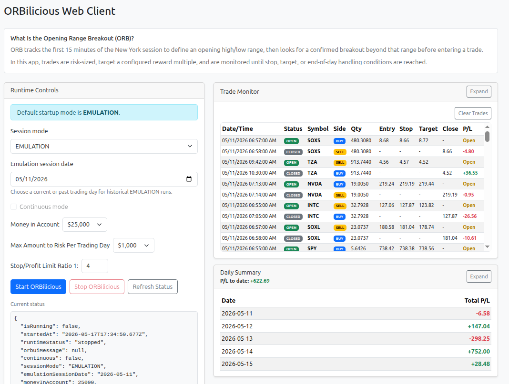

# ORBilicious

## Table of Contents

- [Strategy rules](#strategy-rules)
- [Operational Rules](#operational-rules)
- [Logging](#logging)
- [Setup](#setup)
  - [Configure `.env`](#configure-env)
- [Web UI Usage](#web-ui-usage)
  - [Runtime Controls](#runtime-controls)
  - [Trade Monitor](#trade-monitor)
  - [Daily Summary](#daily-summary)
  - [Reports](#reports)
- [Environment variables](#environment-variables)
- [Report modes and scheduling](#report-modes-and-scheduling)
- [Tests](#tests)
- [Notes](#notes)
- [Recommended next upgrades](#recommended-next-upgrades)



A complete Node + TypeScript starter project for a 15-minute Opening Range Breakout strategy on 1-minute bars with:

- Alpaca market-data integration
- Alpaca bracket-order execution
- Top-40 most active universe scan
- Top-10 long and top-10 short candidate selection
- Weighted total stop-risk sizing
- Basket normalization to fit both total planned stop-loss risk and available buying power
- Winston-based structured logging
- Source-level ORB PDF report generation (end-of-day live or historical by date)

## Strategy rules

- Universe: top 40 most active stocks.
- Opening range: 9:30 to 9:44 ET.
- Entry confirmation: first 1-minute candle close above OR high for long, or below OR low for short.
- Selection: Breakout candidates for long and short trades determined by breakout score.
- Stop loss:
  - Long: opening-range low
  - Short: opening-range high
- Profit target: 4R, where R is the entry-to-stop distance. by default (1:4), or the ratio declared in the environment variable `STOP_LOSS_PROFIT_RATIO`
- Risk budget: total planned stop-loss exposure across the full basket defaults to $1000.
- Basket normalization: trade sizes are scaled so the full basket fits both:
  - configured total stop-loss risk cap
  - Alpaca account buying power

## Operational Rules

The list below follows the order the app actually applies rules at runtime.

1. Startup configuration is validated first. Required Alpaca credentials must exist, numeric settings must parse, `STOP_LOSS_PROFIT_RATIO` must be a valid `risk:reward` pair, `SESSION_MODE` must be `EMULATION`, `PAPER`, or `LIVE`, and `SESSION_DATE` is normalized to `YYYY-MM-DD`.
2. Execution mode is derived next. `EMULATION` always sets `dryRun=true`, `PAPER` and `LIVE` allow real order submission, and `--continuous` keeps the current-day scheduler running across sessions instead of exiting after one session.
3. The app then splits into one of two operating paths: historical emulation or current-day scheduling. Historical emulation is only selected when `SESSION_MODE=EMULATION` and `SESSION_DATE` is set to a date before the current New York date. Live emulation for today stays on the current-day path.
4. In historical emulation, the app builds an inclusive date range from `SESSION_DATE` through the current New York date, then filters that range to weekdays only. If no weekday sessions remain, the run ends immediately.
5. For each historical weekday session, the app emits UI progress messages in this order: `Determing open ranage.`, then `High range prices: {HIGH_RANGE_PRICE}, Low range prices: {LOW_RANGE_PRICE}.`, then `Waiting for breakouts` with the current most-active symbol list when available.
6. Each historical session then generates a full ORB report. If a session cannot be generated because data is unavailable or another error occurs, that session is skipped and the run continues to the next weekday.
7. In current-day mode, the loop runs forever until it is allowed to exit. On weekends it does nothing except wait. Before the New York open it does nothing except wait for the market to open.
8. During market hours, the first 15 minutes are treated as opening-range discovery time. The UI reports `Determing open ranage.` during that window.
9. After the opening-range window completes, the app computes and publishes the opening-range high and low, then publishes `Waiting for breakouts` with the current most-active symbol list when available.
10. Every active cycle starts by loading the Alpaca account. If `tradingBlocked` is true, the cycle stops immediately and no candidate evaluation or order logic runs.
11. The candidate universe is the top `QUANTITY_TO_RETRIEVE` most-active symbols from Alpaca. The default is 40 symbols.
12. Each symbol is evaluated independently. If the account already has an open position in that symbol, the app switches from entry logic to profit-capture management instead of generating a new breakout candidate.
13. Existing-position management follows this order: if the position has no entry price, it is skipped; if there are no session bars, it is skipped; if the current bar is earlier than `FORCE_EXIT_TIME`, it is skipped; at or after `FORCE_EXIT_TIME`, the position is only closed if the latest close is favorable relative to entry price, meaning `latestClose >= entryPrice` for longs or `latestClose <= entryPrice` for shorts.
14. When an existing position is closed by the profit-capture rule, the UI reports `Closing {SYMBOL} for a {PROFIT_LOSS_STATUS} of {PROFIT_LOSS_AMOUNT}.` and the trade monitor records a close event. In `EMULATION`, this is logged as a dry-run close instead of sending a live close order.
15. If no open position exists, duplicate-entry protection is applied next. Any symbol already present in the in-memory `executedToday` set for that session date is skipped.
16. If the symbol has no intraday bars for the session, it is skipped.
17. Candidate construction begins by deduplicating bars, filtering them to the current session date in New York time, and computing the opening range from the configured market open through the first `OPENING_RANGE_MINUTES` minutes. With default settings, that means 1-minute bars from 9:30 through 9:44 ET, and all required bars must exist or the candidate fails.
18. Breakout detection then examines only the next opening-range-sized evaluation window after the opening range. With defaults, that means the next 15 one-minute bars. The first close above opening-range high creates a long breakout attempt, and the first close below opening-range low creates a short breakout attempt.
19. A breakout is not tradeable by itself. The app requires a confirmation retest after the breakout bar. For longs, a later bar must trade back to or below opening-range high and still close above opening-range high. For shorts, a later bar must trade back to or above opening-range low and still close below opening-range low.
20. The bar immediately before the breakout becomes the wick anchor for stop placement. Its high is used for long stop anchoring and its low is used for short stop anchoring.
21. ATR is then computed from session bars up through the confirmation retest using a 14-bar average true range. If ATR cannot be computed or is not positive, the candidate is rejected.
22. Candidate score is computed as `relative breakout percent * log10(total session volume)`. Only candidates with score greater than `MIN_SCORE` survive sizing.
23. Surviving candidates are ranked separately by side. The app keeps the top `MAX_POSITIONS_PER_SIDE` longs and top `MAX_POSITIONS_PER_SIDE` shorts by score. The current default is 3 per side.
24. Risk dollars are assigned proportionally by score across the selected basket, using `MAX_TOTAL_RISK` as the total planned stop-loss budget.
25. Stop price is determined next. If a breakout wick anchor exists, it is used first. Otherwise the stop falls back to the most conservative price produced by the opening-range bound, the ATR-based stop, and the minimum stop-percent rule.
26. Any trade is rejected if stop distance is zero or negative, if entry price and stop price are equal at two-decimal execution precision, or if computed quantity falls below the minimum quantity threshold.
27. Profit target is then set to `takeProfitMultiple * stopDistance`, which is 4R by default because `STOP_LOSS_PROFIT_RATIO` defaults to `1:4`.
28. After initial sizing, the basket is normalized in two passes. First each trade is individually scaled down to obey `MAX_POSITION_NOTIONAL`. Then the whole basket is scaled by the smaller of the risk cap scale and the available buying power scale. Quantities are floored to four decimal places, and anything below the minimum quantity is dropped.
29. Before execution, duplicate-entry protection is applied again at the trade basket stage. Any already-executed symbol for the session date is skipped.
30. In `EMULATION`, entries are never submitted to Alpaca. The app only logs dry-run entries and emits trade-monitor events. In `PAPER` and `LIVE`, the app submits Alpaca bracket orders with the computed entry side, quantity, stop, and take-profit prices.
31. When historical reports contain closed trades, the UI reports `Closing {SYMBOL} for a {PROFIT_LOSS_STATUS} of {PROFIT_LOSS_AMOUNT}.` before emitting the close event into the trade monitor.
32. After `FORCE_EXIT_TIME`, if the end-of-day report for the session has not yet been generated, the app generates it once. In one-shot current-day mode the process then exits. In continuous mode it stays alive and waits for the next session.

## Logging

Logs are written to:

- `logs/combined.log`
- `logs/errors.log`
- `logs/exceptions.log`
- `logs/rejections.log`

Console output is also enabled.

Use `.env` to control log verbosity:

```bash
LOG_LEVEL=debug
```

## Setup

1. Install dependencies:

```bash
npm install
```

1. Create and configure `.env` as described below.

### Configure `.env`

Use [.env.example](.env.example) as the starting template for your local runtime configuration.

Copy the file into `.env`:

```bash
cp .env.example .env
```

Then edit `.env` for operational use:

1. Set `APCA_API_KEY_ID` and `APCA_API_SECRET_KEY` to your own Alpaca credentials.
2. Set `SESSION_MODE` to the mode you intend to run: `EMULATION`, `PAPER`, or `LIVE`. (This value is reset automatically when the UI resets the value.)
3. Set `SESSION_DATE` to a historical date for historical emulation, or leave it blank for current-day operation. (This value is reset automatically when the UI resets the value.)
4. Set `ALPACA_DATA_FEED` to `iex` if delayed market data is acceptable, or `sip` if your Alpaca account has the required entitlement for real-time consolidated market data.
5. Review trading controls such as `MAX_TOTAL_RISK`, `HARD_BASKET_CAP`, `MAX_POSITION_NOTIONAL`, and `MAX_POSITIONS_PER_SIDE` before running. (This value is reset automatically when the UI resets the value.)
6. If you are operating against live capital, verify `ALPACA_TRADING_BASE_URL`, `SESSION_MODE=LIVE`, and all risk settings before starting the app.

The comments in [.env.example](/home/reselbob/Projects/orbilicious/.env.example) explain the meaning of each variable inline.

1. Run in dev mode:

```bash
npm run dev
```

1. Or build and run:

```bash
npm run build
npm start
```

## Web UI Usage

The web client provides a complete control panel to run and monitor the ORB strategy. Start it using:

```bash
./start.sh
```

This launches both the trading app and web server on port 8787 (or use `WEB_PORT=XXXX ./start.sh` to override), and opens the browser automatically.

### Runtime Controls

- **Session mode**: Choose `EMULATION` (Alpaca data, no orders), `PAPER` (paper trading), or `LIVE` (live trading).
- **Emulation session date**: For `EMULATION` mode, select a past trading day to run a historical backtest from that date forward.
- **Continuous mode**: Run the strategy continuously (only available in `PAPER` and `LIVE` modes).
- **Money in Account**: Total account capital available (default $25,000). Overrides `HARD_BASKET_CAP` env var.
- **Max Amount to Risk Per Trading Day**: Maximum total stop-loss risk per day (default $1,000). Overrides `MAX_TOTAL_RISK` env var.
- **Current status**: Real-time execution state (running, stopped, error details).
- **Backtest progress**: For historical runs, shows current date, total dates, and completion.

### Trade Monitor

Live view of all executed entries and closes with:

- **Date/Time**: When the trade entry or close occurred.
- **Status**: `OPEN` for entries, `CLOSED` for exits.
- **Symbol, Side, Qty**: Trade details.
- **Entry, Stop, Target, Close**: Price levels.
- **P/L**: Profit/loss for closed trades, or "Open" for active positions. Green text for profits, red for losses.

Expand the pane to see more rows at once.

### Daily Summary

Aggregated profit/loss by trading day. Shows:

- **Date**: Calendar day.
- **Total P/L**: Sum of all closed-trade P/L for that day. Green for net profit, red for net loss.

Expand the pane to scroll through historical days.

### Reports

- **Select a report**: Choose from generated HTML or PDF reports.
- **Refresh List**: Fetch latest reports from the `reports/` directory.
- **Open Report**: Display the selected report in an embedded viewer.

## Environment variables

The app reads configuration from `.env` (via `dotenv`) and supports the following variables.

| Variable | Required | Default | Purpose and use |
| --- | --- | --- | --- |
| `ALLOW_LONG` | No | `true` | Enables long-side trade eligibility. |
| `ALLOW_SHORT` | No | `true` | Enables short-side trade eligibility. |
| `ALPACA_DATA_BASE_URL` | No | `https://data.alpaca.markets` | Base URL for market data endpoints. |
| `ALPACA_DATA_FEED` | No | `iex` | Alpaca market data feed selector. Use `iex` for the default feed, which may be delayed, or `sip` for real-time consolidated data if your Alpaca subscription supports it. |
| `ALPACA_TRADING_BASE_URL` | No | Mode-dependent (`https://paper-api.alpaca.markets` for `EMULATION`/`PAPER`, `https://api.alpaca.markets` for `LIVE`) | Optional override for trading/account endpoint base URL. |
| `APCA_API_KEY_ID` | Yes | None | Alpaca API key ID. Required for all Alpaca data/account/order API calls. |
| `APCA_API_SECRET_KEY` | Yes | None | Alpaca API secret key paired with `APCA_API_KEY_ID`. |
| `ATR_STOP_MULTIPLE` | No | `1` | ATR multiplier used as one candidate stop-distance component in sizing fallback. |
| `CANDLE_MINUTES` | No | `1` | Bar interval used by strategy logic. |
| `FORCE_EXIT_TIME` | No | `15:55` | NY cutoff used for end-of-day position management and cycle close/report timing. |
| `HARD_BASKET_CAP` | No | `25000` | Hard maximum total notional for the entire basket after normalization. |
| `LAST_ENTRY_TIME` | No | `15:30` | Last allowed NY time for new entries in live loop mode. |
| `LOG_LEVEL` | No | `debug` in development, `info` otherwise | Logger verbosity (`error`, `warn`, `info`, `debug`, etc.). |
| `MAX_POSITIONS_PER_SIDE` | No | `3` | Max number of selected long candidates and short candidates each (top-N per side). |
| `MAX_POSITION_NOTIONAL` | No | `5000` | Per-position notional cap applied before final basket scaling. |
| `MAX_TOTAL_RISK` | No | `1000` | Basket-wide planned stop-loss dollar cap before normalization. |
| `MIN_STOP_PCT` | No | `0.0075` | Minimum stop distance as a fraction of entry price (example: `0.0075` = 0.75%). |
| `NODE_ENV` | No | `development` | Runtime environment mode used for logging format/verbosity defaults. |
| `OPENING_RANGE_MINUTES` | No | `15` | Number of minutes used to build the opening range window. |
| `POLL_INTERVAL_SECONDS` | No | `20` | Wait interval between live loop cycles. |
| `QTY` | No | `1` | Baseline strategy quantity field in config. Not used by weighted basket sizing path. |
| `QUANTITY_TO_RETRIEVE` | No | `40` | Number of most-active symbols to request from Alpaca for candidate generation. |
| `SESSION_DATE` | No | Empty | Session date (`YYYY-MM-DD`). If set, app runs a one-shot historical report for that date and exits; if empty, app runs current-day live scheduling and generates end-of-day report(s). |
| `SESSION_MODE` | No | `EMULATION` | Execution mode: `EMULATION` (Alpaca data, no order submission), `PAPER` (Alpaca paper trading), `LIVE` (Alpaca live trading). |
| `STOP_LOSS_PROFIT_RATIO` | No | `1:4` | Risk/reward ratio in `risk:reward` format. Example `1:2` gives a 2R target. |
| `SYMBOL` | No | `SPY` | Strategy config symbol baseline (kept for config completeness; main scanner still uses most-active universe). |

Notes:

- Date inputs are validated and normalized to `YYYY-MM-DD`.
- Boolean values are parsed as lowercase string `true` or `false`.
- Numeric values must parse as valid numbers or startup will fail fast.
- `ALPACA_DATA_FEED=iex` still allows the app to run, but prices can lag real-time market websites. Use `ALPACA_DATA_FEED=sip` when you need real-time Alpaca data and your account is entitled to that feed.

## Report modes and scheduling

- **Live end-of-day mode (default):** If `SESSION_DATE` is not set, app runs current-day scheduling, starts trading logic at market open, generates one end-of-day ORB report after market close, then exits.
- **Live continuous mode:** Start with `--continuous` (or `-c`) to keep the process running across sessions. In this mode, data gathering/trade cycles run while NY markets are open, end-of-day report generation runs once per session, and the app waits for the next session instead of exiting.
- **Historical one-shot mode:** If `SESSION_DATE=YYYY-MM-DD` is set, app runs a single historical ORB report for that session date and exits.

Usage:

```bash
# Live daily loop with end-of-day report then exit:
npm run dev

# Live continuous mode across sessions:
npm run dev -- --continuous

# Historical report for a specific date:
SESSION_DATE=2026-05-14 npm run dev
```

## Tests

This project uses Mocha + Chai for integration tests.

The test suite covers:

- time utilities
- ORB signal generation
- weighted-risk basket sizing
- basket normalization against risk and buying power
- Alpaca REST read integrations via mocked fetch
- bracket-order request payload construction

The test suite does **not** execute real trades.

Run tests with:

```bash
npm test
```

## Notes

- This project uses direct Alpaca REST calls rather than a separate SDK wrapper.
- Bracket orders are submitted using Alpaca's `/v2/orders` endpoint.
- Buying power is read from Alpaca's `/v2/account` endpoint before basket normalization.
- Realized losses can still exceed planned stop-loss exposure because of slippage, fast markets, gaps, and execution behavior.
- This should be tested in Alpaca PAPER mode before any live use.

## Recommended next upgrades

- Check open orders before sizing and execution.
- Persist daily execution state so restarts do not lose duplicate-entry protection.
- Use an exchange calendar and DST-safe session handling.
- Add asset-tradability and shortability checks.
- Add retry/backoff and rate-limit handling around Alpaca API requests.
